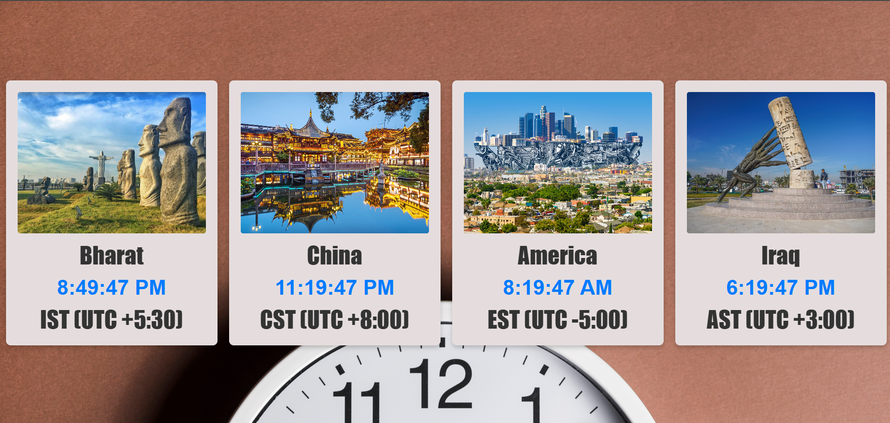

# World Clock 🌐  

A simple world clock web app that shows the current time across different countries / time zones.

[Live Demo → World Clock](https://suyxcode.github.io/world-clock/)

---

## 🖼️ Screenshot / Preview  



---

## 🚀 Features  

- Displays country name + flag  
- Shows corresponding time zone  
- Updates times live (real-time)  
- Clean, minimal UI  

---

## 🧭 How It Works  

1. When the page loads, it fetches the current time for each configured country / timezone.  
2. It displays the country name, flag icon, and the current offset (e.g. `UTC +5:30`).  
3. The UI automatically updates so the clocks remain accurate.

---

## 📁 Project Structure (Example)  

```
/
├── index.html
├── css/
│    └──style.css
├── js/           
│    └──script.js
├── img/
│     └──  ← icons    
│  
└── README.md
```

- **index.html** — Main HTML file that holds the structure of the world clock view  
- **style.css** — Styles for layout, flags, typography  
- **script.js** — Logic to compute and update time displays  
- **assets/flags** — Country flags / icons  

---

## 📦 Usage  

1. Clone or download the repo  
   ```bash
   git clone https://github.com/suyxcode/world-clock.git
   ```  
2. Open `index.html` in a browser  
3. The clocks should display current times automatically  

---

## 🔧 Technologies & Tools  

- HTML  
- CSS  
- JavaScript  
  

---

## 📝 Customization  

- To add a new country / timezone:  
    
  1. In `js/script.js`, include its timezone offset and display logic  
  2. Add corresponding HTML markup or dynamically generate
  3.  Custom styling: modify `style.css`  
    
 


---

## 👨‍💻 Author

👤 **Suyash Singh**  
🔗 [Github](https://github.com/suyXcode)  
💼 [Linkedin](https://www.linkedin.com/in/suyxcode/)  
🌐 [Portfolio](https://suyxcode.netlify.app)


---


